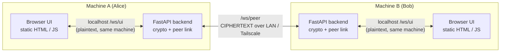

# Secure Instant P2P Messenger — Architecture

CS 5173/4173 Computer Security — course project.

A secure point-to-point instant messaging tool for two parties (Alice and Bob).
The two parties share a passphrase out-of-band and use it to encrypt and decrypt
every message that crosses the network. Messages can be text, images, voice
notes, or arbitrary files, and every message is encrypted with either a 56-bit
key (DES) or a 128-bit key (AES-128).

---

## 1. Goals and non-goals

### Goals
- Two people on two machines exchange encrypted text, images, voice, and files.
- All ciphertext on the network is encrypted end-to-end with a key derived from a
  shared passphrase — no server or third party ever sees plaintext or the key.
- Support both required key lengths: **n = 56 (DES)** and **n = 128 (AES-128)**.
- Derive the key from the passphrase with a KDF; never use the passphrase as the
  key directly.
- A simple graphical interface that displays both plaintext and ciphertext.

### Non-goals (kept out to stay simple)
- No user accounts, login, or contact list — it is always exactly Alice and Bob.
- No message database or persistence — the conversation lives in memory for the
  session.
- No group chat, no message routing, no public-internet deployment.
- Not a hardened production system — it is a teaching implementation whose
  security properties are analyzed honestly in the report.

---

## 2. High-level architecture

Each machine runs **one FastAPI backend** and opens **one browser tab** pointed at
that backend. The browser is the UI; the backend does all cryptography and holds
the direct peer-to-peer link to the other machine. The two backends connect to
each other directly (true P2P) — there is no central relay.



The critical boundary: **plaintext only ever exists inside a machine** (in the
browser and in that machine's own backend, talking over localhost). The moment a
message leaves a machine for the network, it is ciphertext. This is what makes
the shared-passphrase requirement meaningful and gives a clean end-to-end story
to describe in the report.

The application is **symmetric** — the exact same code runs on both machines. The
only runtime difference is that, at connection time, one side dials and the other
accepts.

---

## 3. Components

### 3.1 Static web UI (`web/`)
Plain HTML + CSS + vanilla JavaScript. No build step, no framework. Served by the
backend at `GET /`. Responsibilities:
- Render the two views: connection screen and chat view.
- Capture input: text, file/image picker (File API), voice recording
  (`MediaRecorder`).
- Talk to its own backend over a localhost WebSocket (`/ws/ui`).
- Render received messages by type and display ciphertext alongside plaintext.

It performs **no cryptography** — it hands plaintext to its local backend and
receives already-decrypted plaintext back.

### 3.2 Client backend (`app/`)
Python + FastAPI, run with uvicorn. One instance per machine. Responsibilities:
- Serve the static UI.
- Expose `/ws/ui` for its own browser (plaintext, localhost only).
- Expose `/ws/peer` for the *other machine's* backend (ciphertext).
- Dial the peer's `/ws/peer` when this machine initiates the connection.
- Derive the session key (PBKDF2) and perform all encryption/decryption.

Because crypto lives here, this is the file your security analysis points at.

### 3.3 No relay
Earlier designs used a central relay to dodge NAT traversal on the public
internet. For same-LAN or Tailscale operation both machines are directly
reachable, so the relay is removed. The backends connect straight to each other.

---

## 4. Tech stack

| Layer | Choice | Notes |
|---|---|---|
| Language (backend) | Python 3.11+ | |
| Web framework | FastAPI + uvicorn | Serves UI, native WebSocket support |
| Peer link (outbound) | `websockets` client | Backend dials peer's `/ws/peer` |
| Crypto | `pycryptodome` | DES, AES, PBKDF2, PKCS#7 padding, HMAC |
| Frontend | HTML + CSS + vanilla JS | No framework, no build step |
| Media capture | `MediaRecorder`, File API | Voice notes and file/image attach |
| Transport format | JSON envelope, base64 payloads | See §7 |
| Tooling | git, venv, `requirements.txt` | |

Deliberately **no React / Node**: the UI is a message list, an input box, and a
file picker. A framework would add a build step and a second runtime for the
grader to install, for no benefit at this scale.

---

## 5. Cryptographic design

### 5.1 Key derivation (PBKDF2)
The shared passphrase is **never** used directly as a key. Both sides run:

```
key_material = PBKDF2(passphrase, salt, dkLen, count=200_000, hmac_hash_module=SHA256)
```

- `salt` is generated randomly by the initiator and sent to the peer during the
  connection handshake. The salt is **not secret** — its job is to make each
  session's key unique and defeat precomputation, so sending it in the clear is
  standard and safe.
- `count` (iteration count) is fixed and identical on both sides (e.g. 200,000).
- Both sides derive the same key because they share passphrase + salt + count.

`key_material` is split into an **encryption key** and a separate **MAC key**:

| Cipher | Enc key | MAC key | `dkLen` |
|---|---|---|---|
| DES (n=56) | 8 bytes | 32 bytes | 40 bytes |
| AES-128 (n=128) | 16 bytes | 32 bytes | 48 bytes |

### 5.2 Ciphers
- **n = 56 → DES**, the canonical 56-bit cipher (8-byte key, 8 of whose 64 bits
  are parity). Used in **CBC** mode. Its 56-bit keyspace is exhaustible by brute
  force — this is exactly the weakness the report contrasts against AES.
- **n = 128 → AES-128**, used in **CBC** mode (16-byte key, 16-byte block).

### 5.3 IV and padding
- A fresh random **IV** is generated per message (block size: 8 bytes for DES, 16
  for AES) and travels with the ciphertext in the envelope. The IV is not secret.
- **PKCS#7 padding** (`Crypto.Util.Padding.pad` / `unpad`) fills the final block.
  (PKCS#5 is the same scheme named for the 8-byte case.)

### 5.4 Integrity (encrypt-then-MAC)
CBC alone gives confidentiality but not integrity — an attacker can flip bits or
mount a padding-oracle attack. So every message carries an **HMAC-SHA256** over
`IV || ciphertext`, computed with the separate MAC key. The receiver verifies the
MAC (constant-time) **before** attempting decryption; a failed MAC means the
message is rejected as tampered. This is the encrypt-then-MAC construction and is
worth a paragraph in the report's security analysis.

### 5.5 Key fingerprint (usability check)
After deriving the key, each side computes a short fingerprint, e.g.
`HMAC(mac_key, "fingerprint")[:4]` shown as hex, and displays it. If Alice and Bob
typed different passphrases, their fingerprints differ and they notice
immediately rather than staring at failed decryptions.

### 5.6 pycryptodome reference
```python
from Crypto.Cipher import DES, AES
from Crypto.Protocol.KDF import PBKDF2
from Crypto.Hash import SHA256, HMAC
from Crypto.Util.Padding import pad, unpad
from Crypto.Random import get_random_bytes
```

---

## 6. Message types

All four message types collapse to the same pipeline — **everything is bytes**:

| Type | Source → bytes |
|---|---|
| text | UTF-8 encode |
| image | read file bytes (File API) |
| file | read file bytes (File API) |
| voice | `MediaRecorder` blob → bytes |

Once you have bytes, the path is identical for every type:

```
bytes -> encrypt(IV, key) -> HMAC -> base64 -> JSON envelope -> peer
peer -> parse -> verify HMAC -> decrypt -> bytes -> render by type
```

The receiver renders based on `type`: text as text, image inline (``), voice
in an `<audio>` player, file as a download link using `filename` / `mime`.

---

## 7. Message envelope

The unit that crosses `/ws/peer`. JSON with base64-encoded binary fields:

```json
{
  "v": 1,
  "type": "image",
  "cipher": "AES",
  "keylen": 128,
  "filename": "photo.png",
  "mime": "image/png",
  "iv": "<base64>",
  "ciphertext": "<base64>",
  "mac": "<base64>",
  "ts": 1699999999
}
```

- `cipher` / `keylen` are agreed at handshake and echoed per message so the
  receiver knows how to decrypt.
- `filename` / `mime` are omitted for plain text.
- `salt` is exchanged once at handshake (not per message), since the key is
  derived once per session.

---

## 8. Data flow

### Send (Alice attaches an image)
1. Browser reads the file (File API) → base64 → sends `{type, filename, mime,
   data}` to Alice's backend over `/ws/ui` (localhost, plaintext).
2. Backend base64-decodes to raw bytes, generates a random IV, encrypts
   (DES/AES-CBC + PKCS#7), computes HMAC over `IV || ciphertext`.
3. Backend builds the envelope and sends it over `/ws/peer` to Bob's backend.
4. Backend echoes the message back to Alice's own UI so she sees it (plaintext +
   ciphertext).

### Receive (Bob)
1. Bob's backend receives the envelope on `/ws/peer`.
2. Verifies the HMAC (constant-time). On failure → reject and flag as tampered.
3. Decrypts and unpads → raw bytes.
4. Sends plaintext (base64) **and** the ciphertext (for display) to Bob's UI over
   `/ws/ui`.
5. Bob's browser renders by `type` and offers a toggle to view the ciphertext.

---

## 9. Connection and networking

Each backend runs `uvicorn app.main:app --host 0.0.0.0 --port 8000`. Binding to
`0.0.0.0` (not `127.0.0.1`) is required so the peer machine can reach `/ws/peer`;
this holds for both plain LAN and Tailscale.

Endpoints:

| Endpoint | Peer | Traffic |
|---|---|---|
| `GET /` | own browser | serves `index.html` |
| `WS /ws/ui` | own browser (localhost) | plaintext |
| `WS /ws/peer` | other machine's backend | ciphertext |

### Handshake / connection flow
1. Both machines start their backend and open `localhost:8000`.
2. Both enter the shared passphrase and select the same cipher (DES-56 or
   AES-128).
3. One person (the **initiator**) enters the peer's address (IP:port or Tailscale
   name) and clicks Connect.
4. The initiator's backend generates a `salt`, dials the peer's `/ws/peer`, and
   sends a handshake (`salt`, `cipher`, `keylen`).
5. Both backends derive the session key via PBKDF2 and display the key
   fingerprint.
6. The chat view opens on both sides; messages flow over the established link.

### Addressing
The peer target is a single configurable value, so switching between environments
is a one-line change: `localhost` (dev, both tabs on one machine), the LAN IP
(`192.168.x.x`), or the Tailscale name (`machine-b`). Develop entirely on one
machine first, then flip the address to go two-machine.

---

## 10. Web UI structure

Single page, two states.

### Connection screen
- Passphrase input.
- Peer address input (blank if you intend to wait for the peer to dial you).
- Cipher / key-length selector: **DES (56-bit)** vs **AES (128-bit)** — required
  to demonstrate both.
- Connect button + connection status.
- Key fingerprint (shown after key derivation).

### Chat view
- Scrolling message list; each bubble shows plaintext with a **toggle to reveal
  ciphertext** (satisfies the "Display ciphertext and plaintext" requirement).
- Text input + Send.
- Attach buttons: image, file.
- Record button for voice (`MediaRecorder`), with a simple recording indicator.
- Per-type rendering of received messages (inline image, audio player, download
  link).

---

## 11. Repository layout

```
secure-p2p-messenger/
├── README.md                # how to run (grader-facing)
├── requirements.txt
├── docs/
│   └── architecture.md      # this document
├── app/
│   ├── main.py              # FastAPI: serves UI, /ws/ui, /ws/peer, peer dialer
│   ├── crypto_core.py       # PBKDF2, DES/AES encrypt/decrypt, PKCS#7, HMAC
│   ├── envelope.py          # build / parse JSON envelope
│   └── peer.py              # outbound WebSocket client to the peer
├── web/
│   ├── index.html
│   ├── app.js               # UI logic, /ws/ui WebSocket, media capture
│   └── styles.css
├── config.example.toml      # port, PBKDF2 iterations, default cipher
└── demo/
    └── screenshots/         # for the report
```

---

## 12. Security analysis (for the report)

**What this protects against:** a passive eavesdropper on the network sees only
ciphertext and cannot read messages without the passphrase. Tampering is detected
by the HMAC. AES-128 is not brute-forceable.

**What it does not protect against (limitations to state honestly):**
- **DES (n=56) is brute-forceable** — its 56-bit keyspace is exhaustible; it is
  included to satisfy the assignment and to contrast with AES, not because it is
  secure.
- **No forward secrecy** in the base design — if the passphrase leaks, past
  captured ciphertext can be decrypted. (The key-rotation extra credit mitigates
  this; see §13.)
- **No authenticated key exchange** — the shared passphrase is trusted to be
  exchanged securely out-of-band; the system does not by itself defeat a
  man-in-the-middle who knows the passphrase.
- **Replay** is not prevented in the base design (a timestamp/nonce could be
  added).

---

## 13. Extra credit: key rotation

Periodically re-derive the session key so that a single compromised key exposes
only a small window of messages. Simplest defensible approach: after every N
messages or T minutes, both sides ratchet the key forward,
`key_next = HMAC(key_now, counter)`. This **limits the blast radius** of a key
compromise. Going further, a Diffie-Hellman exchange per rotation would add
forward secrecy — more than the assignment requires, but a strong future-work
note.

---

## 14. Limitations and future work

- Add forward secrecy via a Double-Ratchet-style key schedule.
- Add replay protection (per-message nonce/sequence numbers).
- Add authenticated key exchange so the passphrase need not be pre-shared.
- Persist history (encrypted at rest) if the session needs to survive restarts.

---

## 15. Running (summary)

Full instructions live in `README.md`. In short:

```
pip install -r requirements.txt
uvicorn app.main:app --host 0.0.0.0 --port 8000
```

Run this on both machines, open `localhost:8000` in a browser on each, enter the
shared passphrase, pick the cipher, and have one side connect to the other's
address. For development, run two browser tabs against a single machine using
`localhost`.
